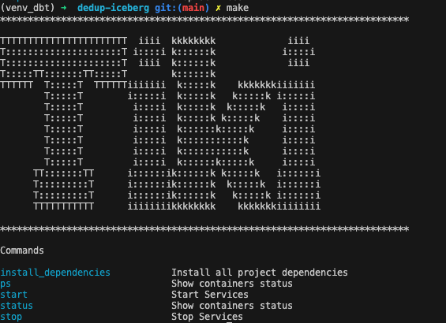
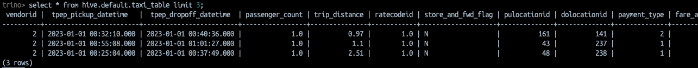
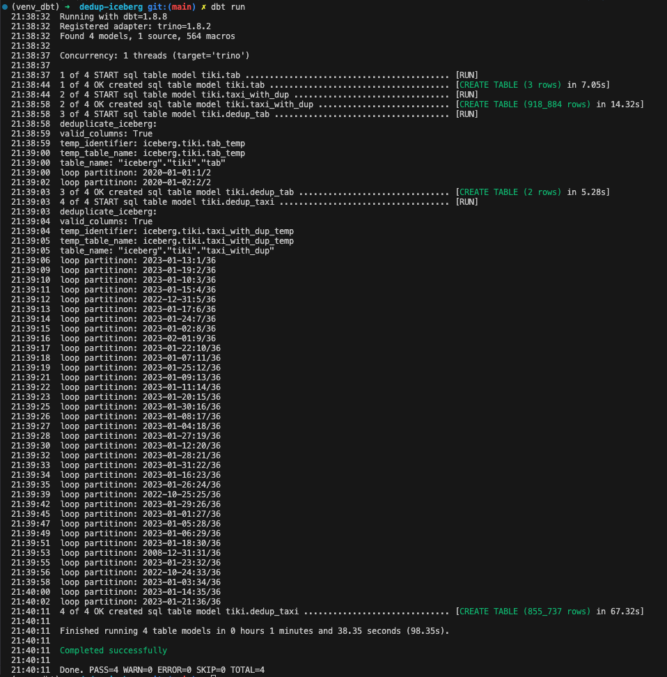

## dbt Macro for Deduplicating Iceberg Tables

This repo contains a dbt macro for deduplicating iceberg tables and a docker development environment. 
 

## dbt macro usage

### deduplicate_iceberg
Remove duplicated rows from a iceberg table and return a new table.

#### Args:
 - table_name(required): dbt table reference that contains duplicated rows.
 - key_columns(required): list of columns used to find duplicates.
 - sort_column(optional, default=None): sort column.
 
#### Usage:
Create a model file and use the macro 

``` deduplicate_iceberg(table_name, key_columns, sort_column = None) ```

```

with import_cte as(
    select 
        *
    from
        {{ deduplicate_iceberg(  
            ref('tab'),   -- source table reference
            ['user_id','my_date'],  -- key columns  
            'my_date'     -- sort column (optional)
            )
        }}
)

select * from import_cte
```


## Setup this repo
### Docker Enviroment Usage

See all avaliable commands

```
make
```


 

Install dependencies

```
make install_dependencies
```

Activate the python env
```
source venv_dbt/bin/activate
```

Run services
```
make start
```
Stop services
```
make stop
```


### Test data
Copy the dataset from ```  /data/yellow_tripdata_2023-01.parquet``` to  ``` s3://datalake/raw/ ``` on datalake (minio)

minio UI: http://localhost:9000

### Sample data

```
{
    "VendorID": "2",
    "tpep_pickup_datetime": 1672533130000,
    "tpep_dropoff_datetime": 1672533636000,
    "passenger_count": 1,
    "trip_distance": 0.97,
    "RatecodeID": 1,
    "store_and_fwd_flag": "N",
    "PULocationID": "161",
    "DOLocationID": "141",
    "payment_type": "2",
    "fare_amount": 9.3,
    "extra": 1,
    "mta_tax": 0.5,
    "tip_amount": 0,
    "tolls_amount": 0,
    "improvement_surcharge": 1,
    "total_amount": 14.3,
    "congestion_surcharge": 2.5,
    "airport_fee": 0
}
```


Create a external table for raw data
```
CREATE TABLE hive.default.taxi_table(
   
    VendorID int,
    tpep_pickup_datetime TIMESTAMP,
    tpep_dropoff_datetime TIMESTAMP,
    passenger_count double,
    trip_distance double,
    RatecodeID double,
    store_and_fwd_flag VARCHAR,
    PULocationID int,
    DOLocationID int,
    payment_type int,
    fare_amount double,
    extra double,
    mta_tax double,
    tip_amount double,
    tolls_amount DOUBLE,
    improvement_surcharge double,
    total_amount double,
    congestion_surcharge double,
    airport_fee double
)with (
    external_location = 's3://datalake/raw/',
    format = 'PARQUET'
) 

```

```
make create_sample_table
```




### Run this repo
```
dbt run 
```

#### output:




### Author
Rodrigo Carneiro (teoria@gmail.com)